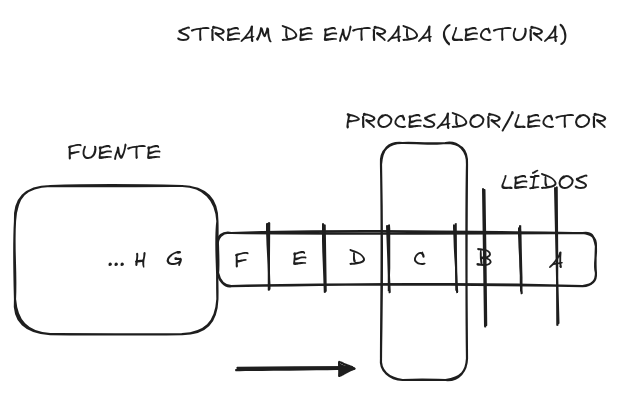
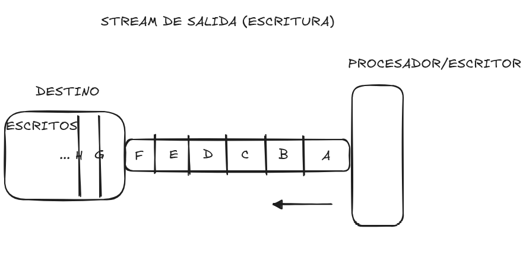

## Stream

En un nivel inicial, el desarrollador java debe comprender el concepto de **stream** o flujo.

Un **stream** se refiere a una **secuencia de datos que se transmite o procesa de manera continua** y que puede ser leída o escrita progresivamente, sin necesidad de que todo el contenido esté disponible desde el inicio.

### Definición formal:

> Un **stream** es una abstracción que representa una **fuente** o un **destino** de datos que se pueden leer o escribir de forma secuencial.

La E/S (I/O) en Java sigue modelo Unix:

- Abrir, usar, cerrar flujo.
- Con flujos estándar: **System.in**, **System.out** y **System.err** 

Estos flujos E/S pueden ser de:

- **Entrada (Lectura)**: donde una fuente genera los datos secuenciales que un procesador lee.

- Salida (Escritura): donde un destino recibe los datos secuenciales que un procesador escribe.
